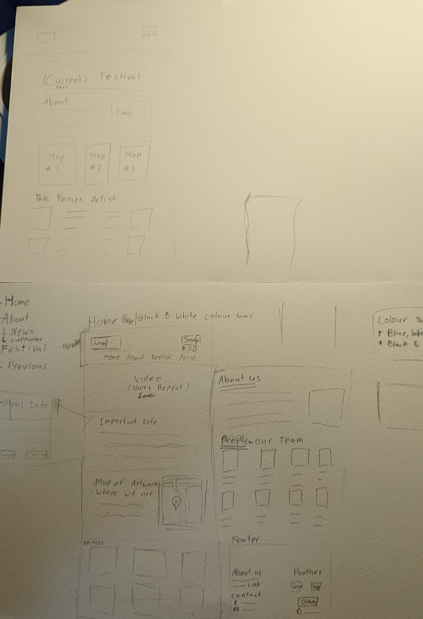
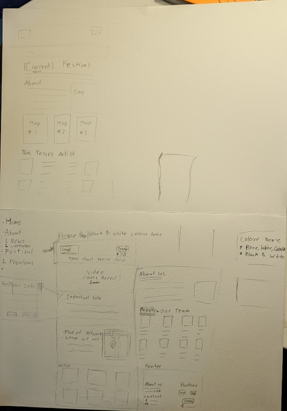

### 11056 Front-End Web Desgin
# Project 1: Responsive Website
## Reflection, by Seth Arnould

  
### Low-fi Prototype
The sketches above show the low-fi prototypes that I drew up at the start of this assessment. These prototypes show the basic layout I was aiming for the design of the website. When coming up with the design I look at many festival sites and the way the designer lay it out. I found from looking at these websites that a lot were quite similar in design and that the designer was probably trying to keep all the main details of the festival on one page (home).  
So when I was coming up with the prototype for the page, I wanted to have a lot of the important stuff about the festival on the home page. for example, I added the maps of the location to show where each artwork would be to the user and added the date of the festival near the top to allow people to know when it is. When looking at websites, some of them included the video on the top part of their home page and I thought this look like a good idea and it would show the user what the festival might look like.  
Some change that was made from the prototype was removing the artist page because when designing the prototype, I thought it might be good to show off all the artists involved in the festival but during the process of creating the website, I realize that a lot of people would know the Artwork and not much about the artist so I decide just to include the Artist info when showing off the artwork. This was the process that I undertook when working on the low-fi prototype phase.  
### Reflect on your Project
The final version of the website that I produce came out quite well and still fit with the vision I was looking for when creating the website. I believe I was able to put in all the information that was needed from the original site into my website and format it nicing into each page.  
Throughout the creation of the website I feel I did multiple things quite well, One of the thing that I believe I did well was the layout of the whole website. With each section being for something different and for the main area the background colour switch between the two for each section. I believe that the layout of the website allows for easy use for anyone and everything is separated nicely. Coming up with a colours for the website was tricky but with the help of   
https://99designs.com.au/blog/tips/website-color-schemes/,
I was able to come up with a nice colour design for the audience of the site. 

Areas that I could have improved are the formatting of the text (choosing font, size, etc), some parts of the media queries, and the flex boxes. Usually, I have a lot of trouble choosing the correct font to use and I had the same problem with this assessment. I just don't know what font would be good to use and if it's good for the site. I decide on doing the 'time new roman' font for this website because it most fits the theme and is slightly easy to read. I handle the responsive / media queries part quite well but some part of it I wish I could have done better. After 400px, the webpage become slightly less responsive for those users because all I did was slightly move the item more to the left so everything stay on screen. If I were to do this again I would research more to try to fix these errors. finally, my flex boxes in this assessment are quite messy and might be hard to understand if someone else looks at my CSS. To maybe fix this I could name each flex item to more specific and understanding names and sort my CSS to make the flex section more understandable for other designers.  
### Briefly Annotated List of Resources
Throughout the creation of the project, I found a lot of resources quite helpful. The two main resources that were most helpful were w3school and Stackoverflow, but other helpful resources were:  
https://99designs.com.au/blog/tips/website-color-schemes/  
 -- for Colour ideas  
https://www.digitalocean.com/community/tutorials/css-collapsible   
-- help on the collapsible   
https://gomakethings.com/how-to-create-a-sticky-navigation-with-only-css/   
https://levelup.gitconnected.com/understanding-use-of-the-and-symbols-in-css-selectors-95552eb436f5

These are some of the sites that were helpful when creating this site.

### Conclusion 
All out I believe that I create a well-ended website that could be used for festivals and that I was able to learn more about CSS and making the website responsive. They are still a lot of things I could improve but overall I was able to achieve the objective.
